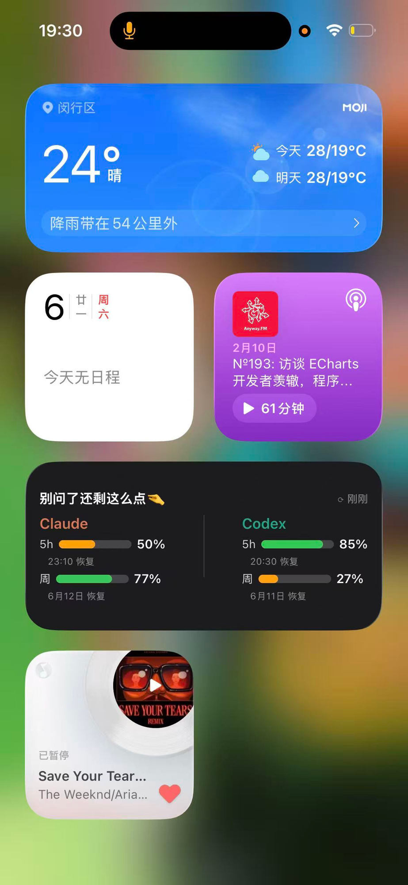

# Twin Refill 🍵

> See at a glance how much longer Claude Code + Codex can keep writing — an iPhone home-screen widget, fully local, zero cost.
>
> "Twin" = the two agents Claude + Codex; "Refill" = when the quota runs dry you wait for the next round. Widget title: **Don't ask, barely any 🤏**

Heavy users of Claude Code / OpenAI Codex all know the feeling of "quota anxiety": can this 5-hour window still take more hard coding? You can't interrupt a long-running task just to go check, and you want to know even when you're away from the computer.

This widget turns both platforms' quota into a card in the iPhone Today view — **glance left, no tapping in, no manual refresh**.

## Features
- **Unified two-platform view**: Claude Code + Codex 5-hour / weekly remaining quota + reset time
- **One platform is fine too**: configure only Claude or only Codex and it auto-switches to a single column
- **Phone-only, fully local**: a native widget written with [Scriptable](https://scriptable.app/) (free) — zero servers, zero cost, no Apple Developer account needed
- **Works even when the Mac is off**: the phone calls each platform's OAuth endpoint directly; tokens live in the iPhone Keychain
- **Zero interruption**: the progress bar reads like a battery gauge — the less remaining, the redder — judge it at a glance

## Requirements
- **iPhone** (iOS 14+) — Scriptable is iOS-only, so **Android is not supported**
- **macOS** — the token-export script currently supports macOS only (PRs welcome for Win/Linux)
- Signed in to **Claude Code** (desktop/CLI) and/or **Codex CLI** (that's where the tokens live locally)

## Install
See [SETUP.md](SETUP.md). Three steps: export the token on the Mac → sync it to the phone → run the script once in Scriptable to import, then add the Medium widget to the home screen.

## Data sources
- Claude: `GET https://api.anthropic.com/api/oauth/usage` (token in the macOS Keychain `Claude Code-credentials`)
- Codex: `GET https://chatgpt.com/backend-api/wham/usage` (token in `~/.codex/auth.json`)

Both endpoints return only a percentage + reset time (no token counts), and both are **community-reverse-engineered, unofficial endpoints** called with tokens already signed in on your own machine. See [PROJECT.md](PROJECT.md).

## Security notes
- Tokens live only in **your own iPhone's Keychain**; the script uploads nothing to any third-party server
- Used only to query **your own account's** quota
- The endpoints are unofficial and may break if a platform changes things; the client_id used for token refresh is a community-known value

## Tech stack
Scriptable (JavaScript) · WidgetKit Medium widget · iOS Keychain · automatic OAuth token renewal

## License
MIT
